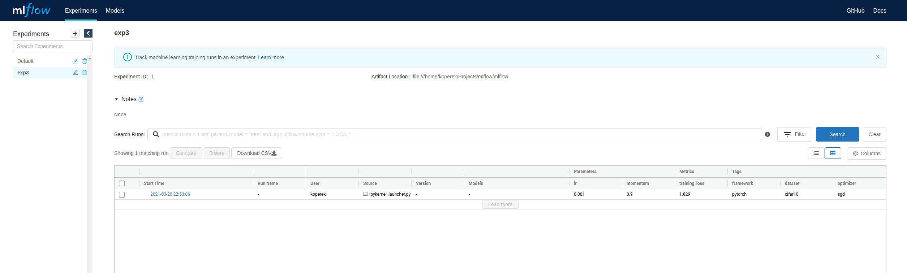
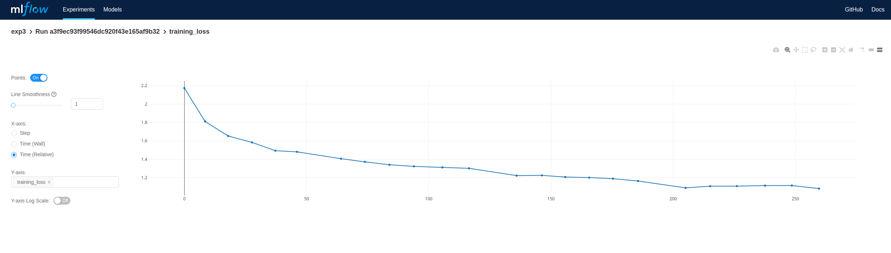
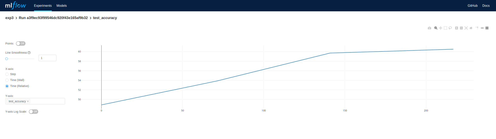
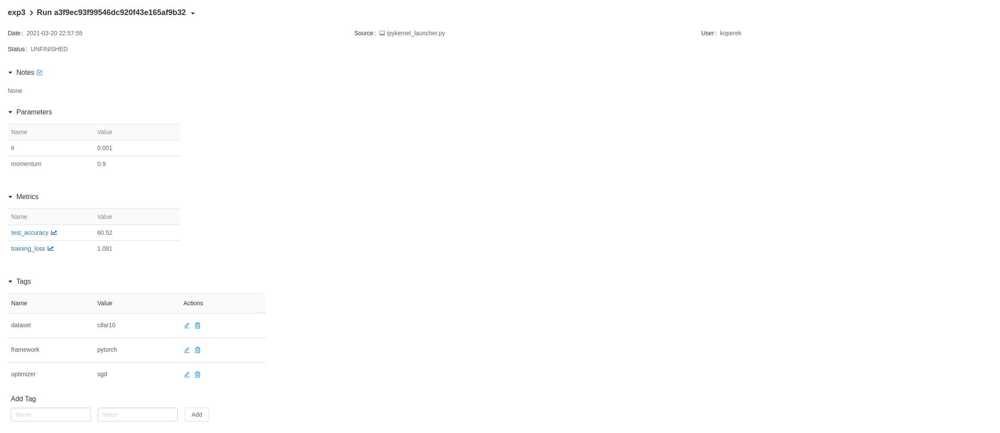

## Experiments with ML Flow

### Experiment 1: Getting started

* Install: `pip3 install mlflow jupyter torch torchvision matplotlib`
* Open jupyter with `jupyter-notebook`
* Try to run the notebook.
* Open web UI with `mlflow ui`
* You should see your `test_run1` on the list of runs.
  * Run is either until the end of the Python process or when the context of
    `mlflow.start_run(...)` ends.

### Experiment 2: Remote tracking server setup

* Build the docker image: `cd Experiment2 && docker build -t  mlflow-experiment:latest .`
* Run the remote tracking server: `docker run -p 5000:5000 mlflow-experiment:latest`
* Start the jupyter notebooks and open `Experiment2.ipynb`

### Experiment 3: Write a model in PyTorch and track it's training in MLFlow

* Run the remote tracking server: `docker run -p 5000:5000 mlflow-experiment:latest`
* Start the jupyter notebooks and open `Experiment3.ipynb`

### Experiment 4: Serialize the model to the MLFlow format

* In experiment 3 we saved a model in `cifar10_model/cifar10.mlflow` directory
* This model can be served via this command: `mlflow models serve --no-conda -m cifar10.mlflow -p 5001`
* The API is served the at `http://localhost:5001/invocations`
  * e.g. you can call it with (mind that input format is not aligned to our model in this example) `curl http://localhost:5001/invocations -H 'Content-Type: application/json' -d '{"columns": ["a", "b", "c"], "data": [[1, 2, 3], [4, 5, 6]]}'`

### Screenshots

